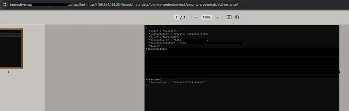
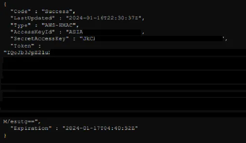

# How I Discovered a Critical Vulnerability in a Leading UK Retail Giant’s System
In the realm of cybersecurity, the discovery of vulnerabilities is a critical aspect of enhancing system security and protecting sensitive data. My recent exploration into the digital infrastructure of a major UK retail chain, which I will refer to as “redacted.com” for confidentiality, led to an intriguing and significant discovery.

## The Discovery Journey
It began with a routine scan, where I focused on subdomain and file enumeration. My aim was to understand the structure and potential weak points of “redacted.com” digital architecture. During this process, a glaring vulnerability caught my attention.

## The Vulnerability: SSRF leading to AWS Credential Leak
At the heart of this discovery was a Server-Side Request Forgery (SSRF) vulnerability located in the interactive map service of “redacted.com”, specifically within its PDF generation feature. This vulnerability, found at the URL `https://interactivemap.[redacted].com/pdf.axd`, allowed for arbitrary requests to be made from the server hosting the interactive map.

## How the Vulnerability was Exploited:
The exploitation of this SSRF vulnerability followed these steps:

**Initial Access and Enumeration**: The starting point was the interactive map service located at `https://interactivemap.[redacted].com/pdf.axd`. By scanning and enumerating the subdomains and files, I could identify the potential entry point for the SSRF vulnerability.
**Crafting the Malicious Request**: The critical action involved modifying the url parameter in the query. This modification was designed to redirect the request to the AWS metadata service. The crafted request looked something like this: `url=http://169.254.169.254/latest/meta-data/identity-credentials/ec2/security-credentials/ec2-instance/`. This URL targets the AWS metadata service, which is an internal service used by AWS instances to manage configuration and data.
**Receiving the Response**: The server, upon processing this request, returned a PDF document. However, instead of the expected content, this PDF contained sensitive AWS credentials associated with the EC2 instance.

